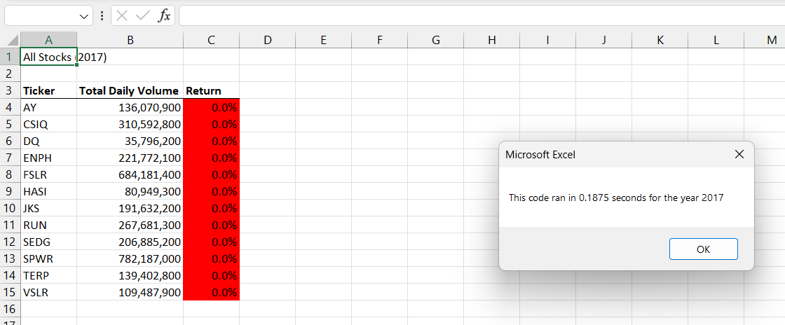
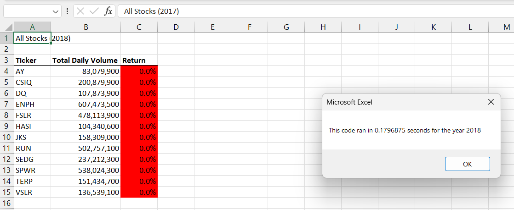

# Stock Analysis of Stocks for 2017 and 2018
## This quick analysis of stocks from 2017 and 2018 will give you insight to help you make an informed decision when choosing where to invest your money.

### Pros and Cons of Refactoring a Macro
There are advantages and disadvantages to refactoring the code for the analysis. One major benefit to refactoring the code is that as a whole, the code is easier to read and simpler to navigate. This makes it easier to catch errors and correct them quicker. Refactoring also speeds up the run time for the code. However, refactoring can be tedious and time consuming. Refactoring could also invite errors into the code that were not there before. This could add additional time to an already lengthy project. It is up to the analyst to decide if the pros refactoring outweight the cons depending on their specific project and their desired outcome.

## Run Times After Refactoring the Code
After refactoring the code, both of the run times for the seperate years ran fast at just under 0.2 each with 2018 running slightly faster than 2017.

